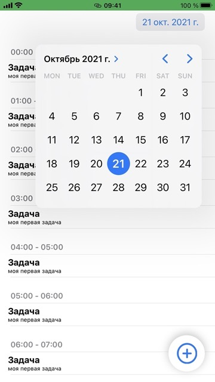

# TODO
Приложение - ежедневник (тестовое задание)

Приложение - тестовое задание для компании SimbirSoft. Необходимо было написать ежедневник.
Для хранения использовать Realm. Не добавлял возможность удаления/изменения объектов, т.к. в тз ничего об этом не говорилось.
---
### Скриншоты: 

---
- конвертер картинки в иконки: [тык](https://makeappicon.com)
